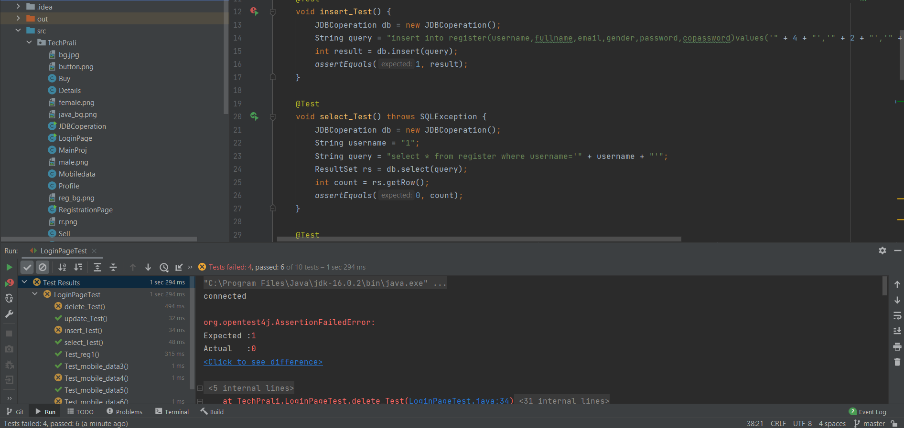

<h1 align="center">
   Tech Prali 
</h1>
<h2 align="left">Introduction</h2>
Tech Prali is a Java-based application. This app is primarily designed for buying and selling of smartphone.The Login page is the first thing the user sees when they open this application. If the user has already registered, they may simply log in with their username and password, or they can sign up by selecting the sign up option. After logging into the app, the user will be taken to the main screen, where a buy panel has already been launched, displaying smartphone data supplied by other users. There are four panels in total: buy, sell, details, and profile. Users can put their own smartphone to the sale panel if they want to sell it. In the details section, you can see the specifics of the smartphone that the user has added, which can be deleted by typing the smartphone's id, which is a unique id.The user's information can be edited and updated via the profile section. All of the data processing was done on the MySQL server.
<h2 align="left">Aim </h2>
The main aim of this project is to comfort a new smartphone buyer, to choose a smartphone that they are likely going to buy.
<h2 align="left">Some GUI glimpse of app</h2>
The first window after running the app is shown below:

This is the registration window

The page below opens after login and is a part of main page.

If the user is male such GUI is shown.

The image below is the sell panel where user describes the smartphone that they want to sell.

The image below is the details panel where users smartphone details are shown. User also can delete the smartphone by entering the id..

The image below is the profile panel where you can update your profile.

The 10 Junit tests that i have done in login, registration, mobile data and user data is showh below.

<h2 align="left">Conclusion</h2>
With the help of this app user can find a perfect smartphone. User also can sell the smartphone. 

